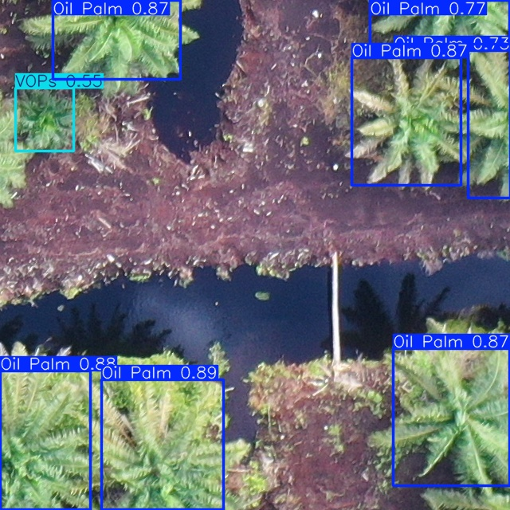
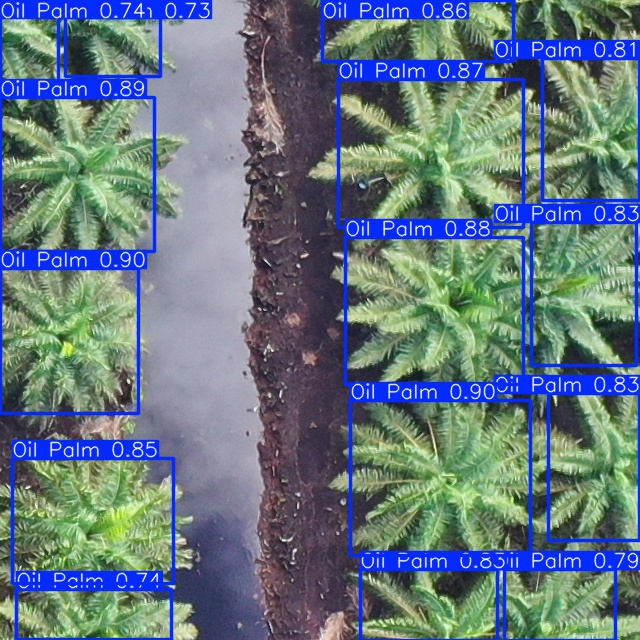
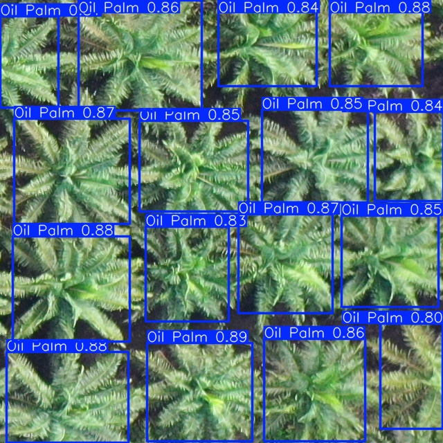
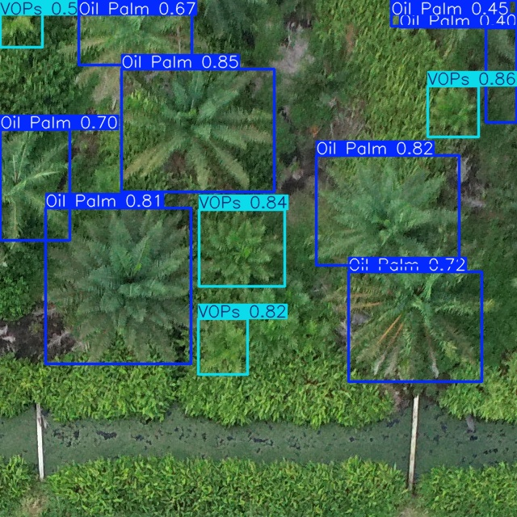
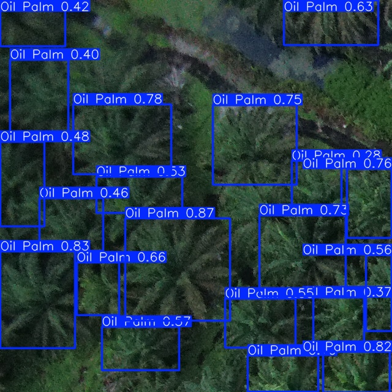
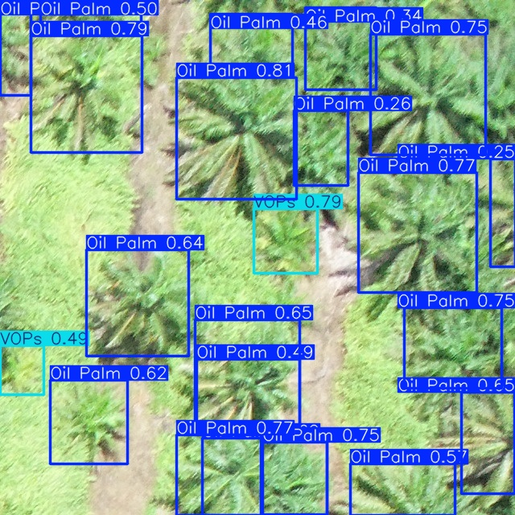
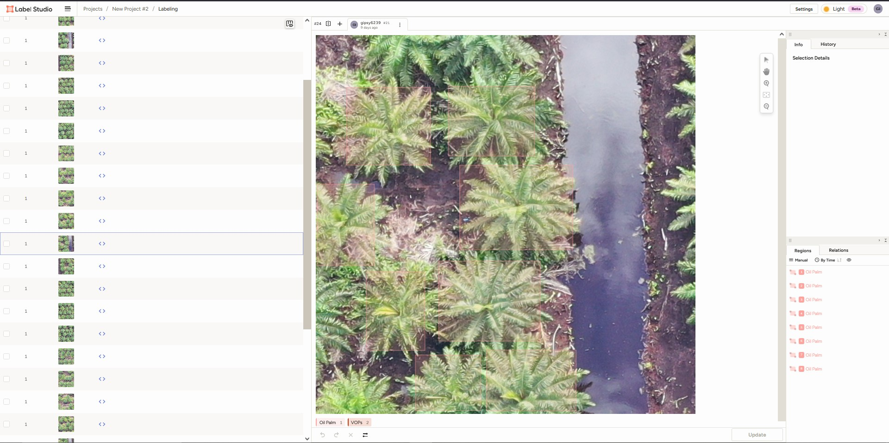

# Oil-Palm-Tree-Detection-with-YOLOv8
**This is an exploratory project** created while learning Python and Computer Vision. It aims to apply YOLOv8 to drone imagery for oil palm detection as part of a personal project and machine learning journey.

This project demonstrates a custom-trained YOLOv8 model to detect **Oil Palm Trees** and **VOPs** (Volunteered Oil Palms) from drone imagery. This is totally an exploratory project for me, part of my own geospatial and machine learning adventure. What I really want to show with it is how even a custom-trained YOLOv8 model can be put together using a **super simple (basic)** method. So if you're beginner looking to get into machine learning, especially object detection, this is definitely a great starting point to see how it all comes together.

---

## Sample Detection

  
  
  
  
  
  

---

## Model in Action
Below is a sample of the model detecting Oil Palm and VOPs in actual drone-captured video:

  

---

## Project Overview

### Task: Detect Oil Palm Trees Using Aerial Drone Imagery

* **Model:** YOLOv8n (Ultralytics)
* **Class:** "Oil Palm" , "VOPs"
* **Tools:** Label Studio, YOLOv8, Python, Jupyter Notebook (VS Code)

---

## Image Source & Preprocessing
The original images were captured at approximately **200 meters altitude**, where trees were too small to detect accurately.

**To address this:**
* Images were **tiled into 640 X 640 pixel patches**
* Only tiles representing a **visual zoom of 30-50 meters** were used for annotation
* Tiles were then used for training the YOLOv8 model.

---

## Data Annotation

A total of **387 images** were annotated using [Label-Studio](https://labelstud.io/)

Bounding boxes manually drawn for:
  * **Oil Palm** (Class 0)
  * **VOPs** (Class 1)

Images were selected under **different lighting conditions** (sunlight, shadows, varying exposures) to **introduce visual diversity** and simulate real-world drone capture scenarios.

Labels were exported in **YOLO Format**, compatible with Ultralytics training.

The final model was trained using these 387 annotated images, yielding the results you can see in the detection preview and performance charts.

### Key Consideration
While this variation in lighting helps the model to generalize slightly better, it was not aggressively optimized for light exposures. This project remains a testing and learning experiment, built for exploration and fun.

  

---

## Model Training

Training was performed across **five iterative batches** to progressively improve model performance. In stage 1, I used default yolov8n.pt model. Then, in stage 2-5, I fine-tuned the model using the best.pt file from the previous round. To keep things fair and consistent, I used the same training settings for all fine-tuning stages, each one was trained for 50 epochs.

## Stage 1: Initial Training from Pretrained YOLOv8n
Train using the default 'yolov8n.pt' weights and your custom data.

  [View Code: Train_Initial_YOLOv8n.py](Training/Train_Initial_Yolov8n.py)

### Stage 2-5: Fine-Tuning from previous Best Checkpoints
Each stage uses 'best.pt' model from the previous batch for further training and adaptation.

  [View Code: Finetune.py](Training/Finetune.py)

### Inference (Prediction)
Run object detection on images, folders or videos using the final trained model.

  [View Code: Predict.py](Training/Predict.py)

---

## Key Results & Takeaways

  

Click to expand

* **Elevated 'VOPs' Precision:** Fine-tuning efforts yielded positive steps forward in identifying "VOPs" more accurately, and encouraging sign for this more challenging class.
* **Solid "Oil Palm" Foundations:** The model largely  retained its strong ability to detect "Oil Palm", indicating that its core capabilities were well-preserved during adaption.
* **A More Balanced Approach:** This iteration of the model demonstrates a more balanced performance across both categories, providing a more consistent detection experiences as i continue the exploration.

### Model Performance

**For a comprehensive look at the detection capabilities**

* **[Explore pretrained Model results Here](Results/Pretrained/README_PRETRAINED.md)**
* **[Discover fine-tuned Model & Comparison Performance Here](Results/Finetuned_model/README_FINETUNED.md)**
  
### Important
* **CONTEXTUAL DETECTION RANGE:** It's important to note that this model was primarily trained on imagery captured within a **30-50 meter range**. Its detection capabilities may therefore be limited or less reliable when applied to significantly higher zoom-out level images.

---

## Downloads
* [best.pt](https://github.com/Chris-pter/Oil-Palm-Tree-Detection-with-YOLOv8/raw/main/Weights/best.pt)  -Final fine-tuned model based on best validation score.
* [last.pt](https://github.com/Chris-pter/Oil-Palm-Tree-Detection-with-YOLOv8/raw/main/Weights/last.pt)  -Final checkpoint from the last training epoch.

---

## Project Scope & Learning Intent

 

Click to expand

This project was created as part of my learning journey in geospatial data, machine learning, and python. It is not intended to be a final or deployable product. but rather a hands-on exploration into how object detection works using drone imagery and YOLOv8n.

### Key Notes:
* The model was trained in a **limited datasets**(387 annotated images) and is best suited for drone imagery captured at approximately 30-50 meters in altitude.
* Annotation was done using **Label-Studio**, focusing on two classes: **Oil Palm** and **VOPs**.
* Images were captured under various lighting conditions to add diversity, but the model was not aggressively optimized for such variation.
* **No further training or model updates** are currently planned, this is intended as a personal exploration.

    
* **I hope this repository can serve as a helpful reference for others who are curious about starting out in machine learning or working with real-world drone and geospatial data.**
 
---

## References

* [Ultralytics YOLO Docs](https://docs.ultralytics.com/)-For model training, inference, and export workflows.
* [Label Studio](https://labelstud.io/)-For flexible image annotation and YOLO-format export.

You are welcome to **explore**, **modify the base code**, and reuse it for **non-commercial learning**, **testing, and experimentation.**

