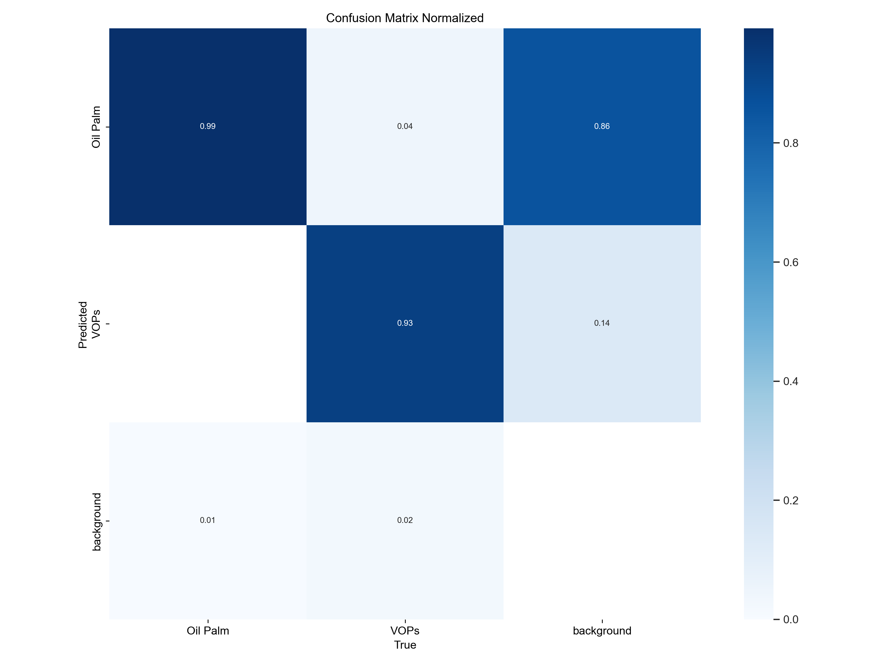

## **YOLOv8n Fine-tuned Model Performance**

This section shows how the YOLOv8n model performed after i trained it several times using my own Oil Palm and VOPs images. The goal was to help the model improve on my custom dataset, especially in detecting the more difficult VOPs class.

### **Insights from Fine-Tuning**
While experimenting with fine-tuning, I saw some nice improvements. The model became better at recognizing **VOPs**, which was the harder class at first. Although the **mAP@0.5** dropped a little (from 0.972 to 0.9689), the predictions for both classes started to feel more balanced. The **F1 Score** stayed at 0.92, but now peaks at a lower confidence, which might mean the model is more confident with fewer mistakes.

* Overall, it was a fun and valuable learning process. Watching the model improve helped me understand how training can shape the results, even with a small dataset.
  
---

## **Performance Analysis & Comparison**

<h4 align="center">Precision-Confidence Curves: Pretrained vs. Fine-tuned</h4>

<em>Figure 1: The fine-tuned model (right) shows slightly better precision for VOPs at different confidence levels. Oil Palm stayed strong in both models.</em>

---

<h4 align="center">F1-Confidence Curves: Pretrained vs. Fine-tuned</h4>

&nbsp; &nbsp; &nbsp; &nbsp;

<em>Figure 2: Side-by-side comparison of F1-Confidence curves. In the fine-tuned model (right),the F1 score for VOPs improved and got closer to Oil Palm. This shows a more balanced detection between both classes.</em>

---

<h4 align="center">Precision-Recall Curves: Pretrained vs. Fine-tuned</h4> 

 
  
   

 

 <em>Figure 3: Side-by-side Precision-Recall comparison. The fine-tuned model (right) appears to maintain a more balanced relationship between precision and recall for both 'Oil Palm' and 'VOPs'. A general view of how well the model detects objects. The fine-tuned model still performs well, especially in maintaining good recall for both classes.</em> 

---

<h4 align="center">Normalized Confusion Matrix: Pretrained vs. Fine-tuned</h4> 

 
  
   

 

 <em>Figure 4: Comparison of normalized confusion matrices. After fine-tuning (right), the class separation between 'Oil Palm' and 'VOPs' looks more distinct, with noticeably fewer misclassifications. It seems that the model is now doing a better job at correctly identifying VOPs which was the weaker class during initial training though I'm still exploring how to interpret these improvements more deeply</em> 

---

<h4 align="center">Training and validation Progress: Pretrained vs. Fine-tuned</h4> 

 
  
   

 

 <em>Figure 5: A visual comparison of how training and validation metrics evolved over time. While I'm still learning how to interpret these curves fully, the fine-tuned model (right) seems to show a more stable trend in precision, recall, and mAP across epochs. Compared to the initial pretrained run (left), this suggests that the model might be adapting more effectively to my dataset as training progresses. It's been interesting to see how each training round shapes the learning behavior..</em> 

