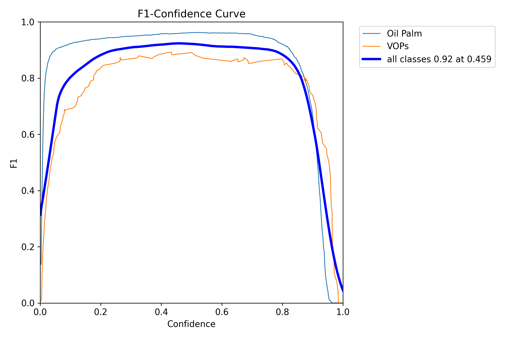
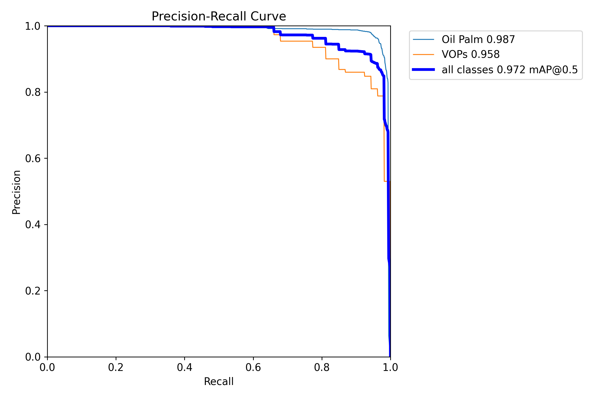
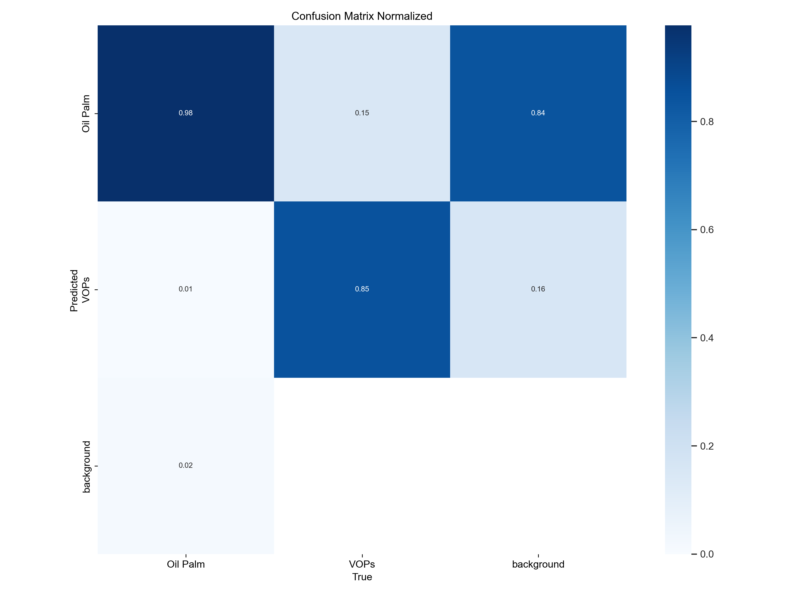

# YOLOv8n Pre-trained Model Performance
This section shows how the original YOLOv8n model performs on our special dataset of Oil Palm trees and VOPS. It is my starting point before we teach the model more about our specific images.

## Performance Snapshot
The original YOLOv8n model does surprisingly well on the dataset:
* **'Oil Palm' Detection**: It's really good at finding 'Oil Palm' trees, with high accuracy and rarely missing them.
*  **'VOPs' Detection**: It finds most 'VOPs' but sometimes get confused, leading to a few false alarms.
*  **Overall Accuracy**: The model is quite accurate overall, scoring a high mAP@0.5 of 0.972. This mean it's already retty good at spotting both 'Oil Palm' and 'VOPs'
*  correctly.

### Individual Performance Graphs
Here are the detailed graphs showing how the pretrained YOLOv8n model performed:

---

<h4 align="center"> Precision-Confidence Curves: Pretrained_YOLOv8n </h4>

  

  <em>Figure 1: This graph shows how precise the model's detections are at different confidence levels. 'Oil Palm' stays very precise, but 'VOPs' is less so, meaning more false detections for 'VOPs' at lower confidence.</em>

---

<h4 align="center"> F1-Confidence (F1-curve): Pretrained_YOLOv8n </h4>

  

  <em>Figure 2: This graph shows the best balance between accuracy and finding all object. The model's overall best F1 score is 0.92 at a confidence of 0.459. 'Oil Palm' has a very strong balance, but 'VOPs' is a bit weaker</em>

---

<h4 align="center"> Precision-Recall Curve: Pretrained_YOLOv8n </h4>

  

  <em>Figure 3: This graph gives an overall view of the model's performance. It shows high accuracy for both 'Oil Palm'(0.987) and 'VOPs'(0.958), with a great average score (mAP@0.5) of 0.972. This means it adapts well to the data from the start.</em>

---

<h4 align="center"> Normalized Confusion Matrix: Pretrained_YOLOv8n </h4>

  

  <em>Figure 4: This matrix shows how often the model corectly identifies each class as a percentage. It correctly identifies 98% of 'Oil Palm' and 85% of 'VOPs'. The 15% missclassification of 'VOPs' as 'Oil Palm'is the main area for improvement. .</em>

---

**Training and Validation Metrics Over Epochs**

<h4 align="center"> Result: Pretrained_YOLOv8n </h4>

  

  <em>Figure 5: This composite graph displays various training and validation metrics over 50 epochs for the pretrained YOLOv8n model. It includes training and validation losses (box, classificatiopn, DFL), along with validation precision, recall mAP50, and mAP50-95, illustrating the model's learning progression.</em>

