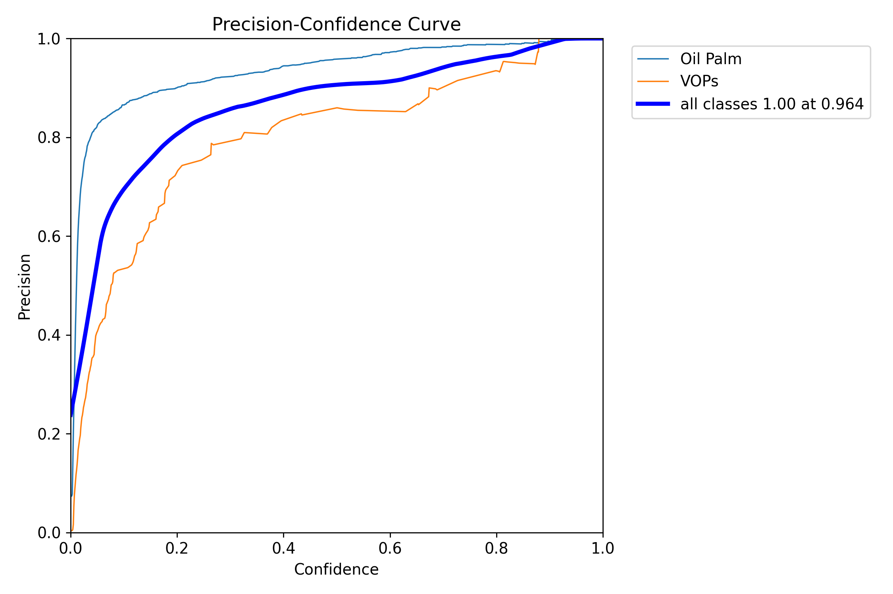
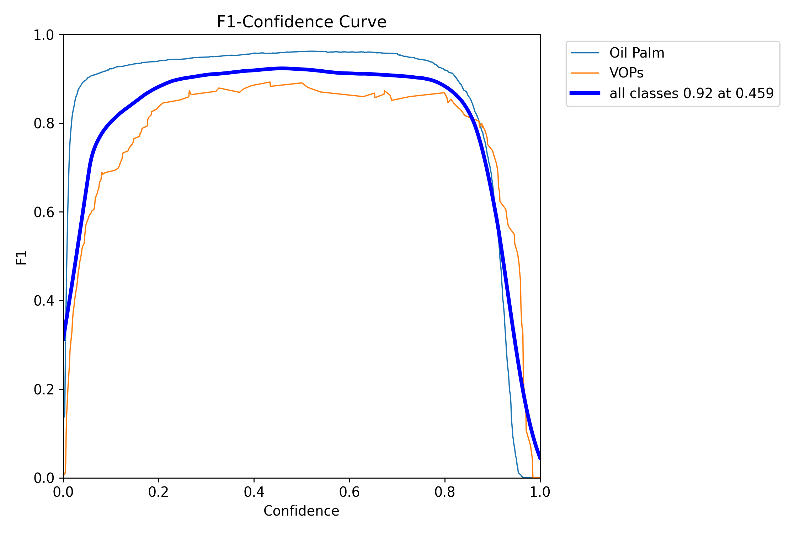
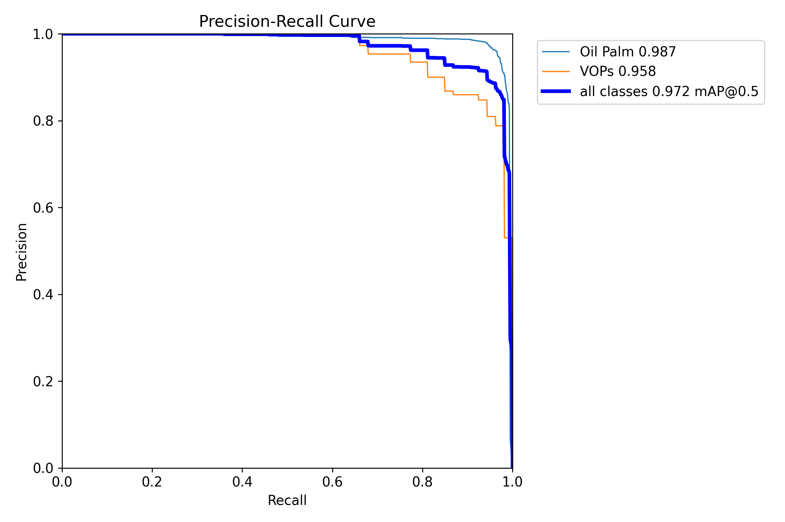
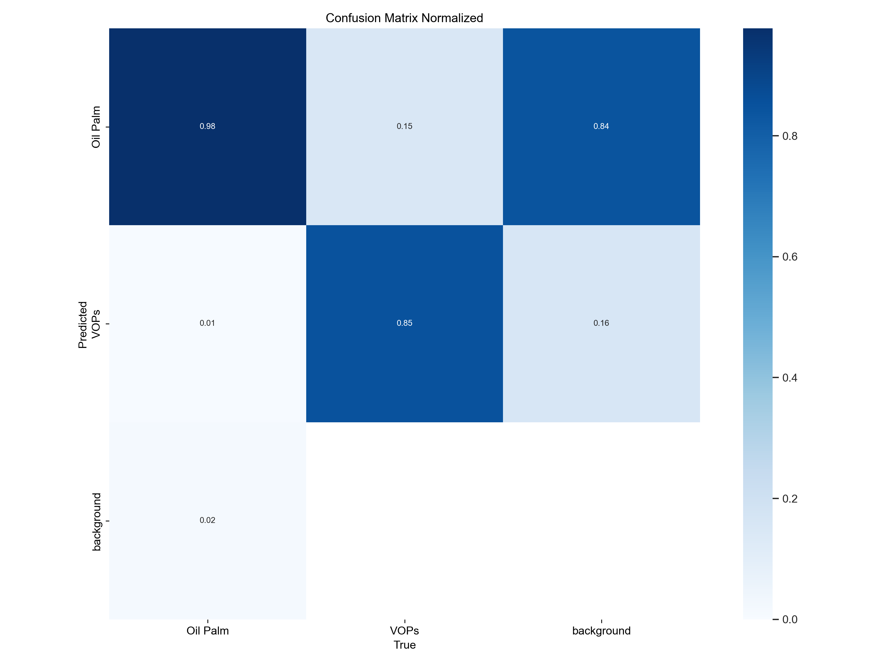
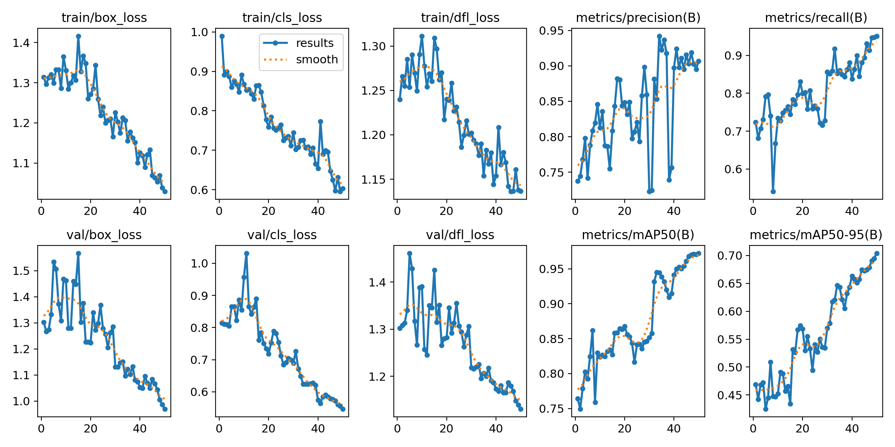

# YOLOv8n Pre-trained Model Performance
This part shows how the **original YOLOv8n model** performed on my custom dataset of Oil Palm trees and VOPs. It was my **starting point** before i tried training or fine-tuning anything. I used this to see how well a general model would work on specific images.

## Performance Snapshot
I included a few graphs like the precision, F1 score, normalized confusion matrix, and training metrics over time. While I'm still learning how to read them all in detail, here is what I learned:

* **'Oil Palm' Detection**: It's really good at finding 'Oil Palm' trees, with high accuracy and rarely missing them.
* **'VOPs' Detection**: It finds most 'VOPs' but sometimes get confused, a few false positives showed up.
* **Overall Accuracy**: The model is quite accurate overall, scoring a high mAP@0.5 of 0.972. This mean it's already pretty good at spotting both 'Oil Palm' and 'VOPs' correctly.

### Individual Performance Graphs
Here are the detailed graphs showing how the pretrained YOLOv8n model performed:

---

<h4 align="center"> Precision-Confidence Curves: Pretrained_YOLOv8n </h4>

  

  <em>Figure 1: This graph helped me understand how confident the model was when detecting trees, especially how often it was correct at difference confidence levels.</em>

---

<h4 align="center"> F1-Confidence (F1-curve): Pretrained_YOLOv8n </h4>

  

  <em>Figure 2: This graph shows the balcance between finding all trees and being accurate.</em>

---

<h4 align="center"> Precision-Recall Curve: Pretrained_YOLOv8n </h4>

  

  <em>Figure 3: This gave me a general view of how the model handled both classes. Looked promising, especially for Oil Palm Trees.</em>

---

<h4 align="center"> Normalized Confusion Matrix: Pretrained_YOLOv8n </h4>

  

  <em>Figure 4: The chart showed me how often the model got things right, and when it mixed up VOPs and Oil Palm.</em>

---

<h4 align="center"> Result: Pretrained_YOLOv8n </h4>

  

  <em>Figure 5: A big picture of the training process. Still learning what all these curves mean, but it shows how the model changed during training.</em>

